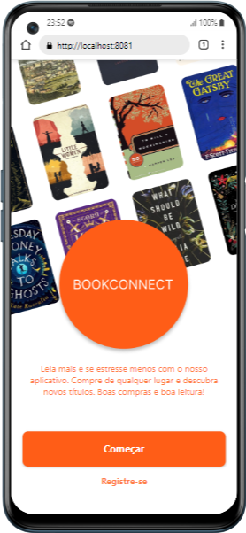
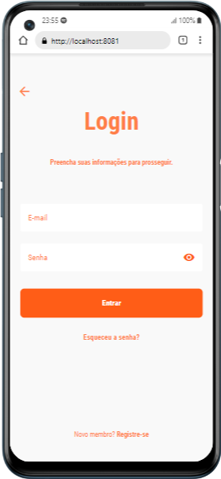

# Bem-vindo ao app bookconnect 👋

<p align="center">  </p>

Este é um projeto que foi criado com [Expo](https://expo.dev). 

Bookconnect é um aplicativo desenvolvido com Expo que permite aos usuários encontrar e comprar livros de uma empresa chamada Bookcase. O aplicativo é construído utilizando `react-native-paper`, `react-native`, `@react-navigation/bottom-tabs` e `@react-navigation/stack`.

## 📝 Visão Geral 

Bookconnect oferece uma experiência fluida para os usuários navegarem e comprarem livros. Através de uma interface limpa e intuitiva, os usuários podem explorar diversos títulos, adicionar livros ao carrinho e finalizar compras de qualquer lugar.

- **Navegação por Abas**: Utiliza `@react-navigation/bottom-tabs` para uma navegação intuitiva entre diferentes seções do aplicativo. 
- **Navegação em Pilha**: Integração com `@react-navigation/stack` para uma navegação eficiente entre telas. 
- **Interface de Usuário Moderna**: Utiliza `react-native-paper` para componentes de UI elegantes e acessíveis. 
- **Catálogo de Livros**: Explore uma vasta coleção de livros disponíveis para compra. 
- **Carrinho de Compras**: Adicione livros ao carrinho e finalize a compra facilmente. 
- **Busca Avançada**: Encontre livros rapidamente utilizando a funcionalidade de busca. 

## 📚 Licença

Este projeto está sob a licença MIT. Veja o arquivo [LICENSE](LICENSE) para mais

## 📱 Tecnologias Utilizadas

- [Expo](https://expo.dev/) 
- [React Native](https://reactnative.dev/) 
- [React Native Paper](https://callstack.github.io/react-native-paper/) 
- [React Navigation](https://reactnavigation.org/)

## 🛠️ Instalação e Uso 

1. Clone o repositório: 

   ```
   git clone https://github.com/seu-usuario/bookconnect
   ```
2. Instale as dependências

   ```bash
   npm install
   ```

3. Inicie o app

   ```bash
    npx expo start
   ```
## 📱 Figma do projeto

### -  [Clique aqui para visualizar o figma do projeto Bookconnect](https://www.figma.com/design/EHGITG7hvnETWoV8Lh7lKJ/bookconnect?node-id=1-761&t=ZyGCUWptT13pvJvg-1) 

## 🤝 Contribuição
Contribuições são bem-vindas! Sinta-se à vontade para abrir issues ou enviar pull requests. Para mudanças maiores, por favor, abra uma issue primeiro para discutir o que você gostaria de mudar.

## 📧 Contato
Para perguntas ou sugestões, entre em contato via jvpeluzio@gmail.com

## 📸 Screenshots
### 1. Tela welcome 

<p align="center">  </p>

### 2. Tela Login 

<p align="center">  </p>

### 3. Tela Home 

<p align="center">  </p>


#### 📚OBS: Este aplicativo está em fase de desenvolvimento.